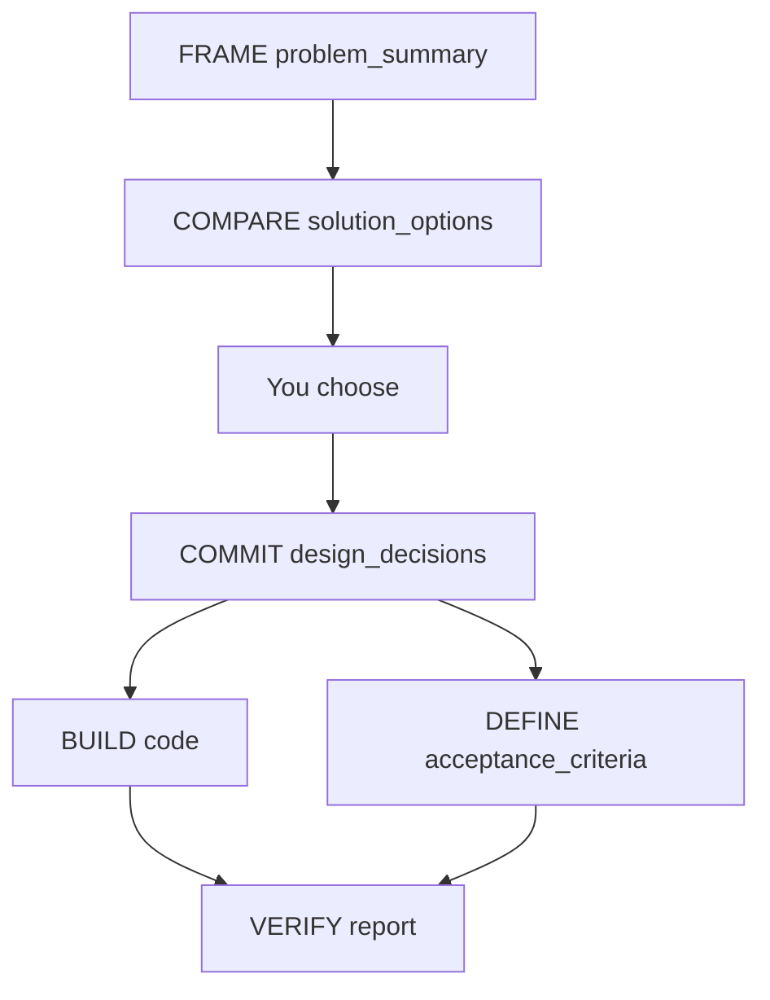

# How to Use — Luke 2026 AI Engineering Toolkit

Human-led, AI-assisted workflow for framing problems, comparing solution options, committing with confidence maps, and shipping with a clear audit trail.

**Start here.** Prompt catalog: [README.md](README.md). **Worked example:** [examples/walkthrough_ig_corpus.md](examples/walkthrough_ig_corpus.md)

---

## Core Flow — FCCBV

Five verbs, five artifacts. Mnemonic: **Frame → Compare → Commit → Build → Verify**.

```
FRAME    →  problem_summary.md       WHAT (requirements + IDs)
COMPARE  →  solution_options.md      OPTIONS (fit matrix, risks, trade-offs)
           →  you choose
COMMIT   →  design_decisions.md      CHOSEN (coverage map + confidence)
BUILD    →  code                     implement Coverage Map
DEFINE   →  acceptance_criteria.md   testable AC-* (before or after BUILD)
VERIFY   →  reports/…                code vs AC-* after BUILD
```

| Mode | Phases |
|------|--------|
| **Default** (coding tasks) | FRAME → COMPARE → choose → COMMIT → BUILD → DEFINE → VERIFY |
| **Formal** (interviews) | above + SHARPEN + diagram/gap/review reports |

Optional between COMMIT and BUILD: **SHARPEN** — refine Medium/Low Coverage Map rows (chat or `04_sharpen_single_decision.md`).

---

## Cheat Sheet

```
┌──────────────────────────────────────────────────────────────────────────┐
│  FCCBV — pin these prompts                                               │
├──────────┬─────────────────────────────────────┬─────────────────────────┤
│  Phase   │  Prompt                             │  Output                 │
├──────────┼─────────────────────────────────────┼─────────────────────────┤
│  FRAME   │  01_frame_problem_summary.md        │  problem_summary.md     │
│  COMPARE │  02_compare_solution_options.md     │  solution_options.md    │
│  ★ YOU   │  pick one option vs PRI-*           │  —                      │
│  COMMIT  │  03_commit_solution_coverage.md     │  design_decisions.md    │
│  BUILD   │  implement Coverage Map             │  src/                   │
│  DEFINE  │  07_define_acceptance_criteria.md   │  acceptance_criteria.md │
│  VERIFY  │  08_verify_acceptance.md            │  reports/…verification  │
├──────────┴─────────────────────────────────────┴─────────────────────────┤
│  Skip unless blocked: 04_sharpen, 05_diagram, 06_analyze_gaps, reviews   │
│  Formal only: 02b_formal_decisions_bootstrap.md                          │
│  ID priority: PRI-* > FR-*/NFR-*/SC-* > AC-*                             │
└──────────────────────────────────────────────────────────────────────────┘
```

### Go / coding task (15–25 min)

```bash
mkdir -p docs/reports
```

1. **FRAME** — paste task + notes → `problem_summary.md` (no solution language)
2. **COMPARE** — `@problem_summary.md` → read Fit Matrix → **you choose**
3. **COMMIT** — paste chosen approach name → `design_decisions.md` Coverage Map
4. **BUILD** — *"Implement per design_decisions.md Coverage Map; trace FR-*/NFR-*"*
5. **DEFINE** — Given/When/Then criteria tracing to FR/NFR
6. **VERIFY** — scan codebase vs every AC-*

Skip SHARPEN unless a Low-confidence row blocks implementation.

---

## Quick Start

```bash
mkdir -p docs/reports
```

**Pin these prompts:**
- `project_toolkit/01_frame_problem_summary.md`
- `project_toolkit/02_compare_solution_options.md`
- `project_toolkit/03_commit_solution_coverage.md`
- `project_toolkit/07_define_acceptance_criteria.md`
- `project_toolkit/08_verify_acceptance.md`

---

## Document Model

| Document | Phase | Role |
|----------|-------|------|
| `docs/problem_summary.md` | FRAME | WHAT — requirements, no solution |
| `docs/solution_options.md` | COMPARE | OPTIONS — compare approaches before choosing |
| `docs/design_decisions.md` | COMMIT+ | CHOSEN — commitment + per-requirement confidence |
| `docs/acceptance_criteria.md` | DEFINE | AC-* — testable criteria tracing to FR/NFR |



---

## Prompt Reference

| Phase | Prompt | Output |
|-------|--------|--------|
| FRAME | [`01_frame_problem_summary.md`](project_toolkit/01_frame_problem_summary.md) | `docs/problem_summary.md` |
| COMPARE | [`02_compare_solution_options.md`](project_toolkit/02_compare_solution_options.md) | `docs/solution_options.md` |
| COMMIT | [`03_commit_solution_coverage.md`](project_toolkit/03_commit_solution_coverage.md) | `docs/design_decisions.md` |
| SHARPEN | [`04_sharpen_single_decision.md`](project_toolkit/04_sharpen_single_decision.md) | updates `design_decisions.md` |
| DIAGRAM | [`05_diagram_architecture.md`](project_toolkit/05_diagram_architecture.md) | Mermaid diagram |
| ANALYZE | [`06_analyze_gaps.md`](project_toolkit/06_analyze_gaps.md) | prioritized gaps |
| DEFINE | [`07_define_acceptance_criteria.md`](project_toolkit/07_define_acceptance_criteria.md) | `docs/acceptance_criteria.md` |
| VERIFY | [`08_verify_acceptance.md`](project_toolkit/08_verify_acceptance.md) | `docs/reports/acceptance_criteria_verification.md` |
| Formal bootstrap | [`02b_formal_decisions_bootstrap.md`](project_toolkit/02b_formal_decisions_bootstrap.md) | bulk `design_decisions.md` draft |

---

## FRAME — Problem Framing

**Prompt:** [`01_frame_problem_summary.md`](project_toolkit/01_frame_problem_summary.md)

**Output:** `docs/problem_summary.md` — IDs, Considerations Coverage, open questions.

**No solution language.**

---

## COMPARE — Solution Options

**Prompt:** [`02_compare_solution_options.md`](project_toolkit/02_compare_solution_options.md)

**Input:** `docs/problem_summary.md`

**Output:** `docs/solution_options.md`

| Section | Purpose |
|---------|---------|
| **Candidate Approaches** | 2–4 named options |
| **Requirements Fit Matrix** | Every SC/FR/NFR × each approach — Fit + Confidence + why |
| **Option Assessment Summary** | Per approach: risks, trade-offs, future concerns, priority alignment |
| **Cross-Option Comparison** | Rollup table |
| **Draft Recommendation** | Leaning toward — **Status: Exploring (not chosen)** |
| **Open Items Before Choosing** | Q-* that affect the decision |

**Fit ratings:** Strong | Adequate | Weak | Required | Overkill | N/A  
**Confidence:** High | Medium | Low (per cell and per option overall)

**You:** Review matrix, discuss in Cursor, **choose one approach** against `PRI-*`.

---

## COMMIT — Solution Coverage Map

**Prompt:** [`03_commit_solution_coverage.md`](project_toolkit/03_commit_solution_coverage.md)

**Input:** `problem_summary.md` + `solution_options.md` + your chosen approach

**Output:** `docs/design_decisions.md` — What We're Building, Coverage Map, Refinement Tasks

Answers: *"Given what we picked, how confident are we on every requirement?"*

---

## SHARPEN — Refine (optional)

@ `problem_summary.md`, `solution_options.md`, `design_decisions.md` — refine Medium/Low rows from Refinement Tasks.

Formal optional: [`04_sharpen_single_decision.md`](project_toolkit/04_sharpen_single_decision.md)

---

## BUILD — Implementation

```markdown
Implement [module] per docs/design_decisions.md Coverage Map.
Trace to FR-* / NFR-* from problem_summary.md.
Respect PRI-* ordering. Clear blocking Refinement Tasks first.
```

---

## DEFINE — Acceptance Criteria

**Prompt:** [`07_define_acceptance_criteria.md`](project_toolkit/07_define_acceptance_criteria.md)

**Output:** `docs/acceptance_criteria.md` — AC-* with Given/When/Then, tracing to FR/NFR.

Run after COMMIT. Can run before BUILD (clarity) or after BUILD (as-built criteria).

---

## VERIFY — Post-Implementation Check

**Prompt:** [`08_verify_acceptance.md`](project_toolkit/08_verify_acceptance.md)

**Input:** `problem_summary.md`, `design_decisions.md`, `acceptance_criteria.md`, codebase

**Output:** `docs/reports/acceptance_criteria_verification.md`

Always run after BUILD.

---

## Traceability Cheat Sheet

| Question | Where |
|----------|-------|
| What are we solving? | `problem_summary.md` |
| **What are the options and how do they fit each requirement?** | **`solution_options.md` §2 Fit Matrix** |
| Risks / trade-offs / future concerns per option? | `solution_options.md` §3 |
| What did we choose? | `design_decisions.md` |
| Confidence for chosen approach? | `design_decisions.md` Coverage Map |
| How do we test it? | `acceptance_criteria.md` AC-* |
| Does the code pass? | `reports/acceptance_criteria_verification.md` |

---

## Checklist

```
[ ] FRAME: problem_summary.md
[ ] COMPARE: solution_options.md — Fit Matrix complete, Status still Exploring
[ ] You chose an approach (cite PRI-*)
[ ] COMMIT: design_decisions.md — Coverage Map
[ ] SHARPEN: blocking Refinement Tasks cleared (if any)
[ ] BUILD: implement
[ ] DEFINE: acceptance_criteria.md
[ ] VERIFY: acceptance_criteria_verification.md
[ ] Optional: diagram, gaps, review reports/
```

---

## Philosophy

- **Frame → Compare → Commit → Build → Verify**
- COMPARE persists options; don't leave them in chat-only
- COMPARE explores; COMMIT commits
