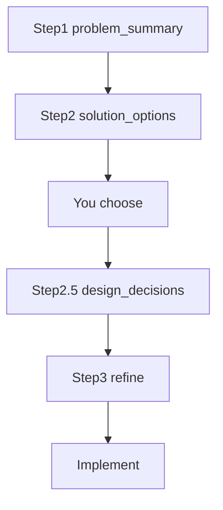

# How to Use — Luke 2026 AI Engineering Toolkit

Human-led, AI-assisted workflow for framing problems, comparing solution options, committing with confidence maps, and shipping with a clear audit trail.

**Start here.** Prompt catalog: [README.md](README.md). **Worked example:** [examples/walkthrough_ig_corpus.md](examples/walkthrough_ig_corpus.md)

---

## Core Flow

```
Step 1  →  problem_summary.md      WHAT (requirements + IDs)
Step 2  →  solution_options.md     OPTIONS (fit matrix, risks, trade-offs)
         →  you choose
Step 2.5 →  design_decisions.md    CHOSEN (coverage map + confidence)
Step 3  →  refine gaps             dig deeper on Medium/Low rows
```

| Mode | Steps |
|------|-------|
| **Default** | 1 → 2 → choose → 2.5 → 3 → implement |
| **Formal** (interviews) | 1 → 2 → 2.5 → 3 refiner prompts → 4–8 reports |

---

## Quick Start

```bash
mkdir -p docs/reports
```

**Pin these prompts:**
- `project_toolkit/1_design_output_problem_summary.md`
- `project_toolkit/2_design_output_solution_options.md`
- `project_toolkit/2.5_design_output_solution_coverage.md`

---

## Document Model

| Document | Step | Role |
|----------|------|------|
| `docs/problem_summary.md` | 1 | WHAT — requirements, no solution |
| `docs/solution_options.md` | 2 | OPTIONS — compare approaches before choosing |
| `docs/design_decisions.md` | 2.5+ | CHOSEN — commitment + per-requirement confidence |



---

## Step 0 — Setup

```bash
mkdir -p docs/reports
```

---

## Step 1 — Problem Framing

**Prompt:** [`1_design_output_problem_summary.md`](project_toolkit/1_design_output_problem_summary.md)

**Output:** `docs/problem_summary.md` — IDs, Considerations Coverage, open questions.

**No solution language.**

---

## Step 2 — Solution Options

**Prompt:** [`2_design_output_solution_options.md`](project_toolkit/2_design_output_solution_options.md)

**Input:** `docs/problem_summary.md`

**Output:** `docs/solution_options.md`

| Section | Purpose |
|---------|---------|
| **Candidate Approaches** | 2–4 named options |
| **Requirements Fit Matrix** | Every SC/FR/NFR × each approach — Fit + Confidence + why |
| **Option Assessment Summary** | Per approach: risks, trade-offs, future concerns, priority alignment |
| **Cross-Option Comparison** | Rollup table |
| **Draft Recommendation** | Leaning toward — **Status: Exploring (not chosen)** |
| **Open Items Before Choosing** | Q-* that affect the decision |

**Fit ratings:** Strong | Adequate | Weak | Required | Overkill | N/A  
**Confidence:** High | Medium | Low (per cell and per option overall)

**You:** Review matrix, discuss in Cursor, **choose one approach** against `PRI-*`.

---

## Step 2.5 — Solution Coverage Map

**Prompt:** [`2.5_design_output_solution_coverage.md`](project_toolkit/2.5_design_output_solution_coverage.md)

**Input:** `problem_summary.md` + `solution_options.md` + your chosen approach

**Output:** `docs/design_decisions.md` — What We're Building, Coverage Map, Refinement Tasks

Answers: *"Given what we picked, how confident are we on every requirement?"*

---

## Step 3 — Refine

@ `problem_summary.md`, `solution_options.md`, `design_decisions.md` — refine Medium/Low rows from Refinement Tasks.

Formal optional: [`3_design_refine_single_decision.md`](project_toolkit/3_design_refine_single_decision.md)

---

## Implementation

```markdown
Implement [module] per docs/design_decisions.md Coverage Map.
Trace to FR-* / NFR-* from problem_summary.md.
Respect PRI-* ordering. Clear blocking Refinement Tasks first.
```

---

## Traceability Cheat Sheet

| Question | Where |
|----------|-------|
| What are we solving? | `problem_summary.md` |
| **What are the options and how do they fit each requirement?** | **`solution_options.md` §2 Fit Matrix** |
| Risks / trade-offs / future concerns per option? | `solution_options.md` §3 |
| What did we choose? | `design_decisions.md` |
| Confidence for chosen approach? | `design_decisions.md` Coverage Map |

---

## Checklist

```
[ ] Step 1: problem_summary.md
[ ] Step 2: solution_options.md — Fit Matrix complete, recommendation still Exploring
[ ] You chose an approach (cite PRI-*)
[ ] Step 2.5: design_decisions.md — Coverage Map
[ ] Step 3: blocking Refinement Tasks cleared
[ ] Implement
[ ] Optional: reports/
```

---

## Philosophy

- **Problem → Options → Choice → Confidence → Refine**
- Step 2 persists options; don't leave them in chat-only
- Step 2.5 commits; Step 2 explores
